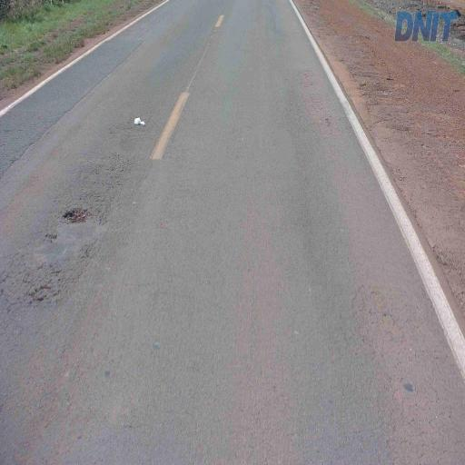
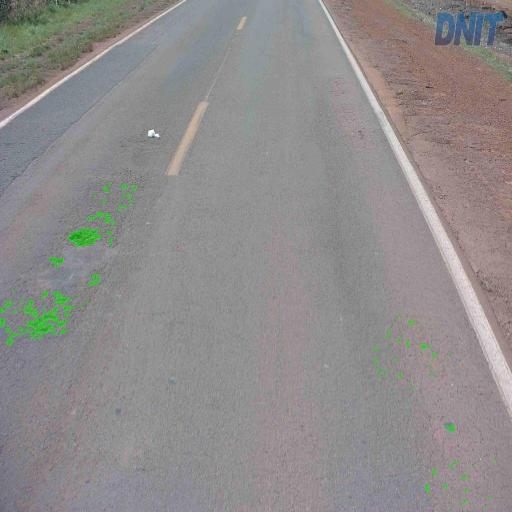

# **smart-arrotino**
Smart Arrotino: identifying cracks and potholes from road images.

## **Dataset**
Smart Arrotino is trained on [Cracks and Potholes in Road Images Dataset](https://github.com/biankatpas/Cracks-and-Potholes-in-Road-Images-Dataset).


Input Image                |  Crack-Pothole Prediction
:-------------------------:|:-------------------------:
  |  

### **Dataset Preparation**
In the *notebooks* folder, open the *prepare_road_dataset.ipynb* and specify where the dataset is saved in:
```
dataset_dir = "PATH/TO/YOUR/DATASET"
```
Run all the cells to split the dataset into train e validation.

## **Train**
Provide training configurations in the *config* folder with the yml file.

Define the class you want to predict in the *classes* list, choose one of:
* lane
* crack
* pothole

**[!!] Currently only single class prediction is implemented.**

If you are on CPU, please use the *default_cpu,yml* as skeleton for your configuration file. Otherwise use *default_gpu.yml*

Run the following command:
```
python3 train.py --config config/your_config.yml --data-dir /path/to/split/dataset --output-dir /path/to/output/folder
```

## **Inference**

Use the *notebooks/inference.ipynb* notebook:
* load the best trained model (ckpt file)
    ```
    model = RoadSegmentationModule.load_from_checkpoint(
        checkpoint_path="PATH/TO/BEST/CKPT"
    )
    ```
* set the input_size, the path to the split dataset, and the class your model predicts
    ```
    input_size = (512, 512)
    dataset = RoadDataset(
        data_dir="PATH/TO/SPLIT/DATASET",
        classes=["CLASS"],
        train=False,
        transform=transform(train=False, input_size=input_size)
    )
    ```

## **To-Do**
[ ] multi-label segmentation

[ ] extended dataset from different sources 

